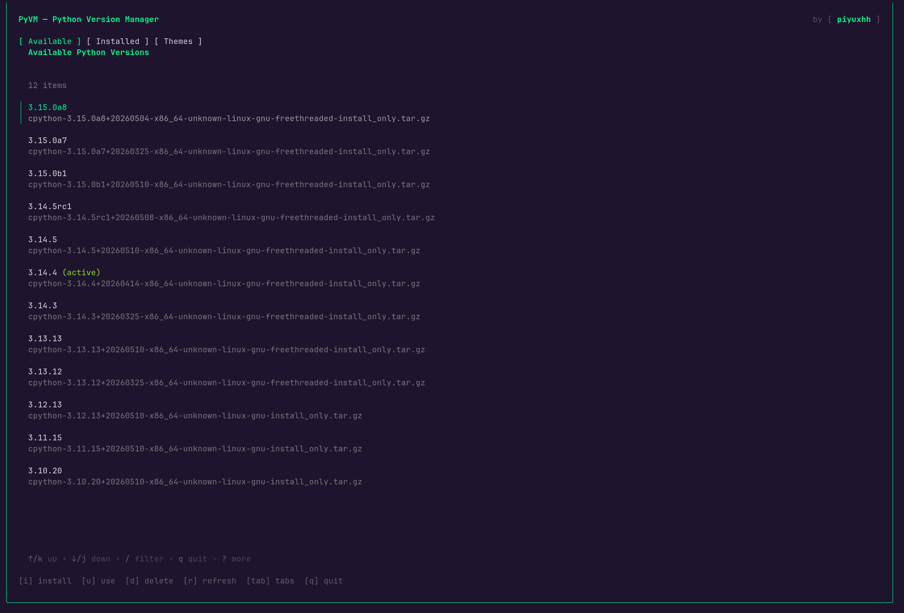

# 🐍 PyVM (Python Version Manager)

[](LICENSE)
[](https://golang.org)
[](https://github.com/superduperpiyuxh/pyvm/pulls)

**PyVM** is a fast, zero-dependency Python version manager written in Go. It allows you to install, switch, and manage multiple Python environments instantly without needing a system Python or a compiler.

---

## ✨ Features

- 🚀 **Zero Dependencies:** Works on a fresh OS without needing Python, `gcc`, or `make`.
- 📦 **Pre-compiled Binaries:** Uses optimized builds for lightning-fast setup.
- 🎨 **Visual TUI:** An interactive terminal interface for those who prefer menus.
- 💻 **Clean CLI:** Standard commands for automation and power users.
- 🪟 **Cross-Platform:** Native support for **Linux**, **macOS**, and **Windows**.
- 🖌️ **Theming:** Built-in color customizer for a personalized experience.

---

## 📸 Preview


*PyVM TUI in action showing version management.*

---

## 🚀 Installation

### 🛠️ Prerequisites
- [Go](https://go.dev/doc/install) 1.23 or higher (only for building from source).

### 1. Build from Source
```bash
git clone https://github.com/superduperpiyuxh/pyvm.git
cd pyvm
go build -o pyvm main.go
```

### 2. Configure Your Environment

#### 🐧 Linux & 🍎 macOS
Add the PyVM shim directory to your shell configuration file (e.g., `~/.bashrc`, `~/.zshrc`, or `~/.profile`):

```bash
export PATH="$HOME/.pyvm/shim:$PATH"
```

#### 🪟 Windows
Add `%USERPROFILE%\.pyvm\shim` to your **User Path Environment Variables**:
1. Search for "Edit the system environment variables" in the Start menu.
2. Click **Environment Variables**.
3. Under **User variables**, select **Path** and click **Edit**.
4. Click **New** and add: `%USERPROFILE%\.pyvm\shim`

---

## 📖 Usage

### 🖥️ Interactive TUI Mode
Simply run `pyvm` without any arguments to enter the visual manager:

- `i` - Install a new Python version
- `u` - Use/Activate a selected version
- `d` - Delete an installed version
- `Tab` - Cycle between **Available**, **Installed**, and **Themes**

### ⌨️ CLI Commands
| Command | Action |
| :--- | :--- |
| `pyvm install 3.12` | Install a specific Python version |
| `pyvm use 3.12` | Switch the active global version |
| `pyvm ls` | List all installed versions |
| `pyvm rm 3.12` | Uninstall a version |
| `pyvm which python` | Show the path to the active binary |
| `pyvm color` | Launch the interactive theme picker |

---

## 📂 Project Structure
- `~/.pyvm/versions`: Where Python builds are stored.
- `~/.pyvm/shim`: Executable shims that route to your active Python.
- `~/.pyvm/config.json`: User preferences and theme data.

---

## 📜 License
Distributed under the MIT License. See `LICENSE` for more information.

---
Created with ❤️ by [superduperpiyuxh](https://github.com/superduperpiyuxh)
